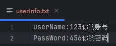

- [x] 登录
- [x] 获取所有课程列表
- [x] 获取活跃课程列表
- [x] 显示所有历史签到事件
- [x] 检测当前课程是否开启签到
- [x] 自动签到
- [ ] 自动刷精品课获取分数（短时间后更新）
- [ ] 接入web，网页可调用docker进行容器化管理（中等时间后更新）
- [ ] 通过AI自动完成老师发布的云班课作业（长时间后更新)

# 待解决问题
目前只能自动签CheckIn_flag为Y的课程，为N的课程会提示签到已结束。需要等待其他大佬进一步逆向。
# 使用方法
先修改
不修改也可在程序运行时填入
然后
cd到autosign.jar文件所在目录，使用java -jar autosign-1.3.jar  启动程序，输入云班课账号密码，即可开始自动签到

# Tip
程序使用java8构建，运行环境为java8以上

如有问题请提issue

# 鸣谢
感谢所有大佬提供的逆向思路和接口，我其实只会萌新逆向，使用的都是大佬们逆向的接口。

简洁，优雅，安全，强大的语言.
